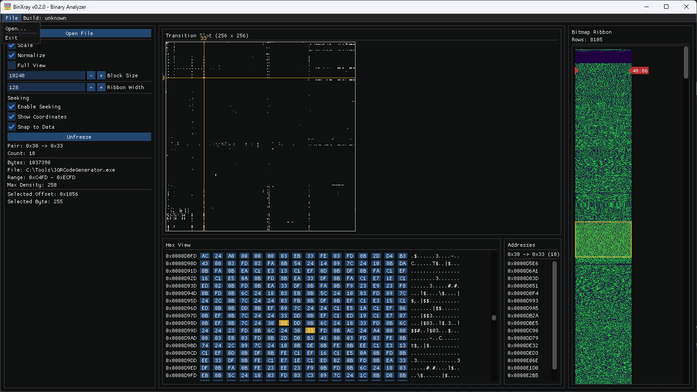

<!-- SPDX-License-Identifier: MIT -->
# Bin X-ray

**Bin X-ray** is the C++ successor of the original **[BinView](https://github.com/russlank/BinView)** utility, focused on fast interactive binary inspection with an ImGui desktop UI.

## Screenshots

## Current Phase

Phase 2 parity core is now implemented:

- Async `Open File` flow for large binaries.
- Legacy-compatible transition matrix engine (`P[256][256]`).
- Legacy control set: `Scale`, `Normalize`, `Full View`, `Block Size`.
- Three-column workspace:
  - left command controls
  - middle plotting + hex views
  - right bitmap ribbon (`128` width, `(32,byte,64)` coloring) with scrolling/scrub.
- Expanded automated tests for binary loading and transition-matrix formulas.

## Requirements

- Windows 10/11
- Visual Studio 2022 (v143 toolset)
- Windows SDK 10.0+
- Python 3 (for version helper script)

## Quick Start

1. Open `src/BinXray.slnx` in Visual Studio.
2. Select `Debug|x64`.
3. Build the solution.
4. Run:
   - app: `src\\x64\\Debug\\BinXray.exe`
   - tests: `src\\x64\\Debug\\BinXray.Tests.exe`

Or from VS Code, use tasks:

- `Build BinXray (x64 Debug)`
- `Run BinXray (x64 Debug)`
- `Run Tests (x64 Debug)`

## Repository Layout

- `src/BinXray` application code
- `src/BinXray.Tests` test runner and tests
- `src/vendor/imgui` vendored Dear ImGui
- `.vscode` shared build/run/debug configuration
- `scripts` local build/release helper scripts
- `packaging` installer scaffolding
- `doc` project documentation
