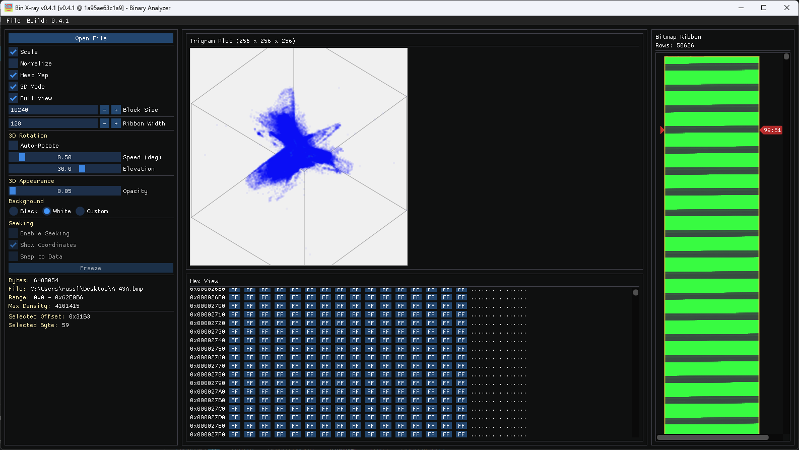

<!-- SPDX-License-Identifier: MIT -->
# Bin X-ray

**Bin X-ray** is the C++ successor of the original **[BinView](https://github.com/russlank/BinView)** utility, focused on fast interactive binary inspection with an ImGui desktop UI.

At its core, the tool renders a **byte-pair scatterplot** — a 256×256 matrix where each cell `(x, y)` represents how often byte value `x` is immediately followed by byte value `y` in the file. This fingerprint reveals structure, repetition, compression, and entropy at a glance. In windowed mode the matrix becomes a **sliding byte-pair plot**, updating in real time as you scrub through the file via the bitmap ribbon overview, letting you watch structural patterns shift across the binary.

A companion **3D byte-trigram scatter plot** extends the analysis into three dimensions: every consecutive triplet of bytes becomes a point in a 256³ cube, revealing higher-order structural patterns that are invisible in the 2D matrix.

## Screenshots

## Features

### 2D Transition Analysis
- Legacy-compatible byte-pair scatterplot engine (`P[256][256]`) with **Scale**, **Normalize**, **Full View**, and **Block Size** controls.
- **Sliding byte-pair plot**: scrub the bitmap ribbon to slide the analysis window and watch the scatterplot update in real time.
- **Heat-map colour mode**: toggle between greyscale and a blue→cyan→green→yellow→red gradient for better density perception.
- **Transition seeking**: hover the scatterplot to select a byte pair, see all matching offsets in a scrollable address list, and navigate directly to each hit in the hex view.
- **Snap-to-data**: the seeking crosshair automatically snaps to the nearest non-empty cell within a configurable Chebyshev radius.

### 3D Trigram Scatter Plot
- Interactive 256³ voxel scatter plot rendered via orthographic ImDrawList projection with wireframe cube and axis labels.
- **Mouse-drag rotation** (yaw/pitch) and **double-click reset**.
- **Auto-rotation** with adjustable speed (0.05–5.0 deg/frame) and elevation (−89° to 89°).
- **Point opacity slider** (5 %–100 %) to reveal dense clusters without hiding shadowed points.
- **Canvas background presets**: Black (default), White, or Custom with an RGB colour picker.
- **Canvas clipping** prevents wireframe edges, labels, and dots from overflowing into adjacent panels.
- Heat-map / greyscale colour toggle shared with the 2D plot.

### Navigation & Inspection
- Async `Open File` flow for large binaries.
- **Bitmap ribbon navigation**: click any pixel to jump to that byte offset; red pointer triangles and a coordinate label mark the current position. Drag to scrub the analysis range.
- **Ribbon adaptive scaling**: fractional pixel scaling when the ribbon width exceeds panel space.
- Virtualised hex view (ImGuiListClipper) with seek highlighting and programmatic scroll-to support.
- **ASCII column highlighting**: per-character colouring matches hex byte highlight state.
- Byte inspector panel for the selected offset.
- Three-column workspace: left controls · centre plot + hex view · right bitmap ribbon.

### Performance
- **Dirty-index tracking** in trigram computation: only written voxels are zeroed between recomputations, avoiding a full 64 MB clear.
- **Static heat-map LUT**: a 256-entry colour lookup table is built once and shared by both 2D and 3D rendering.
- **Optimised projection math**: division folded into scale factor; bit-shift row/column indexing in the 2D matrix loop.
- **Event-driven idle rendering**: when nothing is animating or loading, the main loop sleeps via `MsgWaitForMultipleObjects`, dropping CPU/GPU utilisation to near-zero.

### Testing
- Five automated test suites: `ByteFormatterTests`, `BinaryDocumentTests`, `TransitionMatrixTests`, `TransitionSeekerTests`, `TrigramPlotTests`.
- Edge cases covered: empty data, single byte, sub-ranges, boundary clamping, maxResults capping, self-transitions, inverted ranges, repeated trigram accumulation, mapIntensity modes, opacity-alpha validation.

## Requirements

- Windows 10/11
- Visual Studio 2022 (v143 toolset)
- Windows SDK 10.0+
- Python 3 (for version helper script)

## Quick Start

1. Open `src/BinXray.slnx` in Visual Studio.
2. Select `Debug|x64`.
3. Build the solution.
4. Run:
   - app: `src\\x64\\Debug\\BinXray.exe`
   - tests: `src\\x64\\Debug\\BinXray.Tests.exe`

Or from VS Code, use tasks:

- `Build BinXray (x64 Debug)`
- `Run BinXray (x64 Debug)`
- `Run Tests (x64 Debug)`

## Repository Layout

- `src/BinXray` application code
- `src/BinXray.Tests` test runner and tests
- `src/vendor/imgui` vendored Dear ImGui
- `.vscode` shared build/run/debug configuration
- `scripts` local build/release helper scripts
- `packaging` installer scaffolding
- `doc` project documentation
